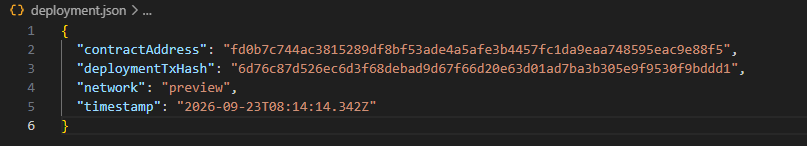
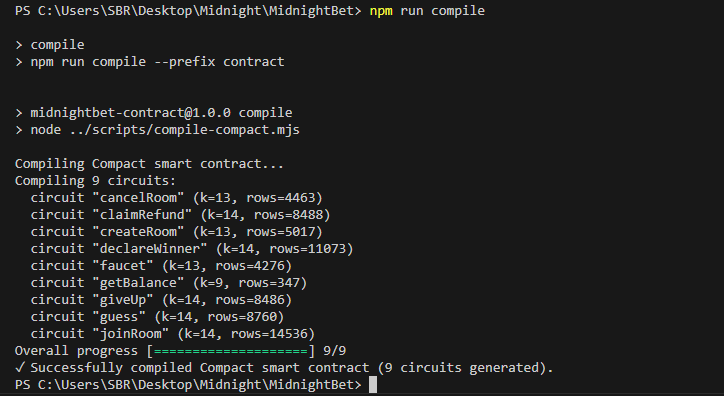

# MidnightBet

## Product Idea
MidnightBet is a privacy-first, zero-knowledge multiplayer number guessing and betting dApp built on the Midnight Network. Players create and join ephemeral game rooms using short 6-character room codes. A host privately commits to a secret target number using zero-knowledge commitments (`persistentCommit`). Participants stake in-game tokens and submit guesses in synchronized rounds without exposing private player keys. When a correct guess is made, the host reveals and proves the solution via a zero-knowledge circuit (`declareWinner`), which verifies against the on-chain commitment and awards the accumulated token prize pool without ever trusting a centralized intermediary.

---

## Deployed Contract Address (Midnight Preview Testnet)

- **Network:** Midnight Preview Testnet
- **Central Hub Contract Address:** `fd0b7c744ac3815289df8bf53ade4a5afe3b4457fc1da9eaa748595eac9e88f5`
- **Deployment Transaction Hash:** `6d76c87d526ec6d3f68debad9d67f66d20e63d01ad7ba3b305e9f9530f9bddd1`
- **Deployment Timestamp:** `2026-09-23T08:14:14.342Z`
- **Configuration File:** `deployment.json` / `frontend/.env`



---

## Public State vs Private Witness

Midnight separates on-chain ledger state (public to all indexers and nodes) from private witness data (processed client-side inside the ZK prover).

### 1. Public On-Chain Ledger State
The following data is stored on the Midnight ledger and queryable through the indexer:
- **`roomPhase`**: Current status of each room (`WaitingForPlayers`, `InProgress`, `Finished`, `Cancelled`).
- **`roomCreator` / `roomPlayerAtIndex`**: Public keys of the room creator and joined players.
- **`roomTargetHash`**: Zero-knowledge cryptographic commitment (`Bytes<32>`) of the secret target number.
- **`roomLatestGuesses` / `roomCurrentRound`**: The public guess numbers submitted per round by players to advance gameplay.
- **`roomTotalPool` / `roomStakeAmount`**: The token stake per player and total room prize pool.
- **`roomWinner`**: The public key of the winning player once a valid ZK proof is verified on-chain.

### 2. Private Witness State
The following secrets never leave the user's client machine or wallet:
- **`getUserSecret()`**: Private spending/signing seed used to derive the player's pseudonymous on-chain identity (`deriveUserPublicKey`).
- **`getTargetSalt()`**: A 32-byte cryptographically random salt generated locally by the room creator.
- **`targetNumber`**: The actual secret target number chosen by the host. It remains completely confidential until revealed and verified through the ZK circuit during `declareWinner`.

---

## Prerequisites

- **Node.js**: v20+ / v22+
- **Compact Compiler**: v0.19+ (pre-compiled artifacts provided under `contract/managed/`)
- **Browser Wallet**: [1AM Wallet](https://1am.xyz/) (recommended, includes built-in ZK ProofStation) or [Lace Wallet](https://www.lace.io/)
- **Testnet Tokens**: tNIGHT & tDUST from the [Midnight Preview Faucet](https://faucet.preview.midnight.network)

---

## Setup & Local Execution

### 1. Install Dependencies
```bash
npm install
npm install --prefix contract
npm install --prefix dapp
npm install --prefix frontend
```

### 2. Compile Contract (Compact)
```bash
npm run compile
# Compiles contract/src/guessing-game.compact -> contract/managed/guessing-game/
```



### 3. Copy ZK Proving Artifacts
```bash
npm run copy-zk
# Copies keys/ and zkir/ into frontend/public/ for browser-side proving
```

### 4. Run Test Suite
```bash
npm test
# Runs Vitest suites for contract and dapp packages
```

### 5. Launch Frontend DApp
```bash
npm run frontend
# Launches Vite dev server strictly on http://localhost:3000
```

---

## Compact Circuits

| Circuit | Role | Privacy / ZK Action |
|---|---|---|
| `createRoom` | Creator | Publishes room configuration & commits to target hash |
| `joinRoom` | Player | Stakes tokens and joins active room with player public key |
| `guess` | Player | Submits guess for current round |
| `declareWinner` | Creator | Proves in ZK that `targetNumber + targetSalt` matches `roomTargetHash` |
| `giveUp` | Player | Forfeits round if unable to guess |
| `cancelRoom` | Creator | Cancels game if players fail to join, enabling refunds |
| `claimRefund` | Player | Withdraws staked tokens from a cancelled room |

---

## Project Structure
```
MidnightBet/
├── contract/            # Compact smart contract & generated ZK circuits
│   ├── src/             # guessing-game.compact (Compact v0.19+)
│   ├── managed/         # Generated ZK keys, zkir, and TypeScript bindings
│   └── test/            # Vitest smart contract test suite
├── dapp/                # Midnight.js SDK integration & witness providers
│   ├── src/             # Providers, private state storage, and game client
│   └── test/            # TypeScript hashing & API tests
├── frontend/            # React + Tailwind + Vite Web Application
│   ├── src/             # Zero-deployment UI (Join Room & Create Room)
│   └── public/          # ZK keys and zkir configuration
└── deployment.json      # On-chain contract deployment metadata
```

