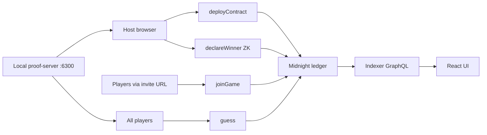

# Complete MidnightBet — Updated Plan

## What We Are Building

A **multiplayer ZK number-guessing game** on the [Midnight Network](https://docs.midnight.network/) blockchain:

1. Host creates a game (player count, range, stake) and privately commits a target number on-chain as `targetHash` via `persistentCommit`.
2. Players join via invite URL (`/?game=<contractAddress>`), each locking an in-contract stake.
3. Players submit one guess per round; when everyone has guessed, the next round starts automatically.
4. Host calls `declareWinner` with a ZK proof that the stored guess matches the committed target; the pool transfers to the winner.
5. If cancelled or all players give up, `claimRefund` returns stakes.



---

## Honest Current State (~75–80% complete)

> **The old plan said ~30–40%. That was based on earlier stubs. A full audit of the codebase shows all three layers are substantially implemented.**

### Contract — Complete (not yet compiled)

[`contract/src/guessing-game.compact`](contract/src/guessing-game.compact) is the full, correct Compact source:

| Circuit | Status |
|---|---|
| `constructor` | ✅ Sets all ledger state, uses `persistentCommit` for targetHash |
| `faucet` | ✅ Adds 1000 tokens to caller |
| `joinGame` | ✅ Stake deducted, starts game when `maxPlayers` reached |
| `guess` | ✅ Round-based, blocks double-guess, auto-advances round |
| `declareWinner` | ✅ Verifies `persistentCommit(targetNumber, salt)` vs `targetHash`, pays pool |
| `giveUp` | ✅ Fixed — compares `giveUpCount.read() == (maxPlayers as Uint<32>)` (type aligned) |
| `cancelGame` | ✅ Host-only, WaitingForPlayers only |
| `claimRefund` | ✅ Marks player refunded, returns stake |

**What's missing:** `contract/managed/guessing-game/` does not exist because `npm run compile` has not been run yet. **This is the only build blocker.**

### DApp Layer — Complete

All files in [`dapp/src/`](dapp/src/) are real, working implementations:

| File | What it does |
|---|---|
| [`hash.ts`](dapp/src/hash.ts) | `persistentCommit` from `compact-runtime` with `CompactTypeUnsignedInteger(Uint<64>)` |
| [`private-state.ts`](dapp/src/private-state.ts) | `loadOrCreateSecretKey`, `rememberHostGame`, `hostRecordFor`, `privateStateFor` |
| [`providers.ts`](dapp/src/providers.ts) | Full Lace connect, all provider stack wired to testnet-02 |
| [`game-api.ts`](dapp/src/game-api.ts) | `buildWitnesses`, `ledgerToGameState`, `encodeInviteLink`, `decodeInviteLink` |
| [`game-client.ts`](dapp/src/game-client.ts) | `deployGame`, `connectToGame`, `subscribeGameState`, all `callTx.*` wrappers |
| [`index.ts`](dapp/src/index.ts) | Correct re-exports of everything the frontend needs |

### Frontend — Complete (all live, no mocks)

| File | What it does |
|---|---|
| [`MidnightContext.tsx`](frontend/src/MidnightContext.tsx) | Real Lace connect, real providers, `attachGame` via `findDeployedContract`, formatted errors |
| [`App.tsx`](frontend/src/App.tsx) | Routing, invite-link auto-detection, error banner |
| [`Home.tsx`](frontend/src/components/Home.tsx) | Prompts wallet connect if needed |
| [`CreateGame.tsx`](frontend/src/components/CreateGame.tsx) | Calls `deployGame`, auto `callFaucet` + `callJoinGame` for host, shows invite link |
| [`JoinGame.tsx`](frontend/src/components/JoinGame.tsx) | Reads `?game=` from URL, calls `attachGame`, `callFaucet`, `callJoinGame` |
| [`GameArena.tsx`](frontend/src/components/GameArena.tsx) | Indexer subscription, `callGuess`, host-only `declareWinner`, `giveUp`, `cancelGame`, `claimRefund` |

The previously reported "hardcoded 42" and fake opponents no longer exist. The arena reads all state from `subscribeGameState` (indexer subscription).

### Infra — Complete

- `docker-compose.yml` runs the proof server on `:6300`
- `NETWORK_CONFIG` points to `testnet-02` indexer + RPC
- `scripts/copy-zk-artifacts.mjs` copies compiled keys to `frontend/public/`

---

## What Is Actually Left (6 tasks)

### 1. Compile the Compact Contract — BLOCKER

Everything fails until this is done.

```bash
# 1. Install the Compact CLI
# See: https://docs.midnight.network/getting-started/installation#install-compact
# Version must be >= 0.23.0 to match the pragma in guessing-game.compact

# 2. Compile
cd contract
npm run compile
# expands to: compact compile src/guessing-game.compact managed/guessing-game

# 3. Copy ZK artifacts to frontend
cd ..
npm run copy-zk
```

**Expected output after compile:**
```
contract/managed/guessing-game/
  contract/index.js   ← JS bindings (Ledger type, Contract, witnesses)
  keys/               ← proving keys per circuit
  zkir/               ← ZK intermediate representation
```

**If compile fails:**
- Check Compact CLI version vs `pragma language_version >= 0.23.0` in the contract
- If circuit names in `GAME_CIRCUITS` in `providers.ts` don't match what Compact generates, update accordingly

---

### 2. Verify Hash Alignment (post-compile)

[`hash.ts`](dapp/src/hash.ts) already uses `persistentCommit` from `compact-runtime`:

```ts
const UINT64 = new CompactTypeUnsignedInteger((1n << 64n) - 1n, 8);
export function computeTargetHash(targetNumber: bigint, salt: Uint8Array): Uint8Array {
  return persistentCommit(UINT64, targetNumber, salt);
}
```

After compilation, check whether `contract/managed/guessing-game/contract/index.js` exports a type descriptor for `Uint<64>`. If so, import and use it to guarantee byte-perfect alignment:

```ts
// Preferred post-compile version:
import { types } from '../../contract/managed/guessing-game/contract/index.js';
export function computeTargetHash(targetNumber: bigint, salt: Uint8Array): Uint8Array {
  return persistentCommit(types.Uint64, targetNumber, salt);
}
```

> [!IMPORTANT]
> If the hash doesn't match, `declareWinner` will always revert with "Target hash mismatch". Confirm this works before the E2E test.

---

### 3. Vite Static File Serving for ZK Artifacts

After `npm run copy-zk`, files land in `frontend/public/` which Vite serves automatically. Verify:

- `copy-zk-artifacts.mjs` copies to exactly the path `FetchZkConfigProvider` requests (typically `/keys/<circuitName>.pk` and `/zkir/<circuitName>.zkir`)
- If the local proof server has CORS issues, add a Vite proxy in `frontend/vite.config.ts`

---

### 4. Real Contract Simulator Tests

Current tests in [`contract/test/guessing-game.test.ts`](contract/test/guessing-game.test.ts) only check source text and file presence. After compile, add simulator tests covering:

- Constructor sets correct ledger values
- `faucet` adds 1000 tokens
- `joinGame` deducts stake, starts game at `maxPlayers`
- `guess` blocks double-guess in same round, advances round when all guessed
- `declareWinner` pays pool to correct player
- `claimRefund` after `cancelGame` returns stake
- `giveUp` by all players triggers `Cancelled`

---

### 5. Manual E2E Smoke Test

1. `npm run proof-server` — start Docker proof server on `:6300`
2. `npm run frontend` — start Vite dev server
3. Open two browsers with different Lace accounts (testnet-02, with tNIGHT → tDUST)
4. **Host:** Connect Lace → Create Game → copy invite link
5. **Joiner:** Open invite URL → Connect Lace → Join Game → Enter Arena
6. Both: Submit guesses
7. **Host:** When "A guess matches the target" appears → Declare Winner
8. Verify winner's balance increases on-chain
9. Test cancel path: host cancels lobby → both players claim refund

---

### 6. Docs and Minor Cleanup

| Item | Action |
|---|---|
| `README.md` | Accurate overall — add explicit note that `npm run copy-zk` must run after compile |
| `dapp/src/cli.ts` | Implement (hash utility) or remove the `cli` script from `package.json` |
| `.gitignore` | Ensure `contract/managed/` is listed (ZK keys are large binary files) |

---

## Implementation Order

```
Install Compact CLI
  → npm run compile  (inside contract/)
    → npm run copy-zk
      → Verify managed/ structure + FetchZkConfigProvider paths
        → Fix hash.ts type descriptor if needed
          → npm run proof-server + npm run frontend → manual E2E
            → Write simulator-based contract tests
              → Polish docs
```

---

## Success Criteria

A host and a second browser (two Lace accounts on testnet-02) can:

1. **Create** — contract deploys, invite link appears
2. **Join** via invite URL — player count increments on-chain
3. **Guess** in rounds — round counter advances when all have guessed
4. **Host declares winner** — arena shows winner, pool transferred
5. **Cancel + refund** — both players' balances restored

No hardcoded numbers. No mock providers. No simulated guesses.

---

## Appendix: Package Versions (already in dapp/package.json)

| Package | Version |
|---|---|
| `@midnight-ntwrk/compact-runtime` | `0.16.0` |
| `@midnight-ntwrk/midnight-js*` | `4.1.1` |
| `@midnight-ntwrk/dapp-connector-api` | `4.0.1` |
| Compact CLI (to install) | `>= 0.23.0` |

